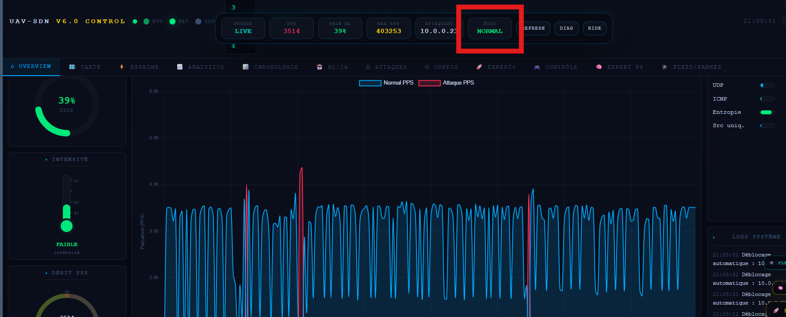
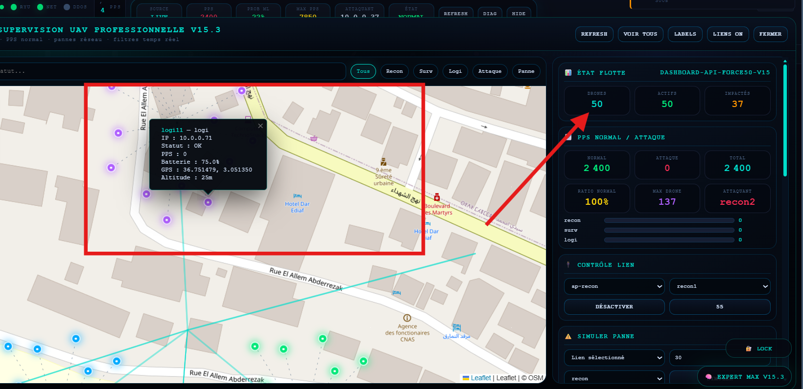
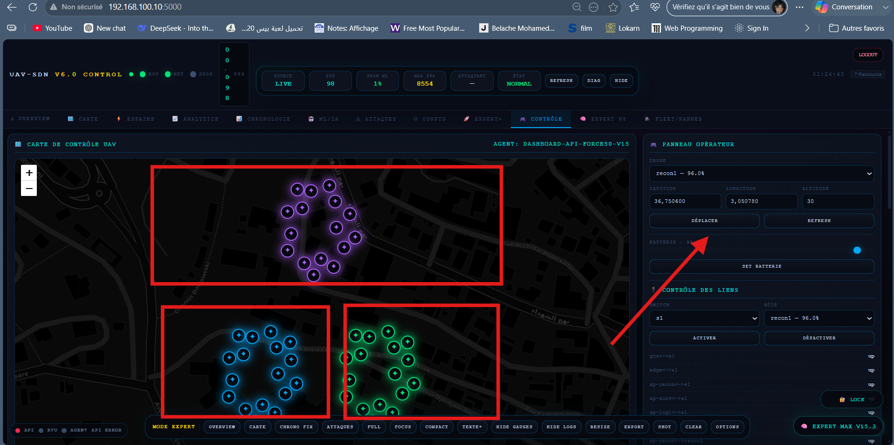
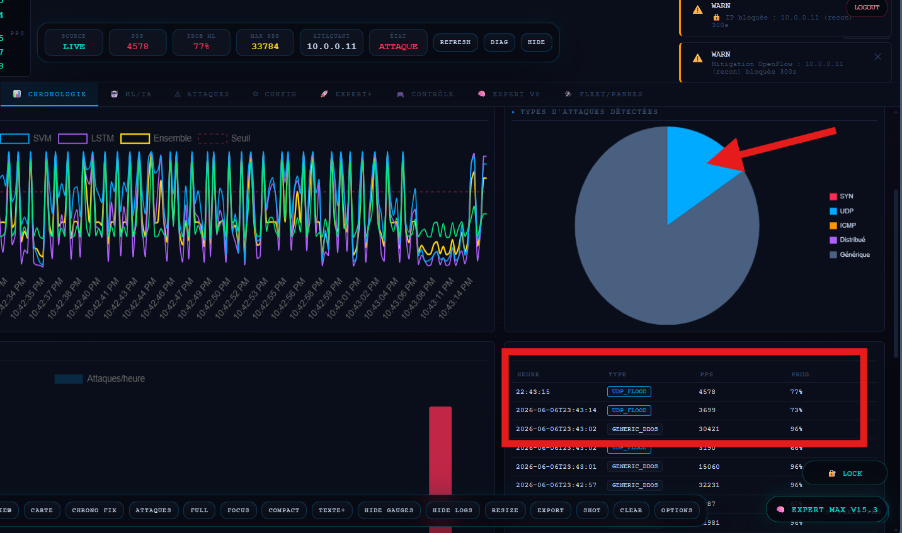
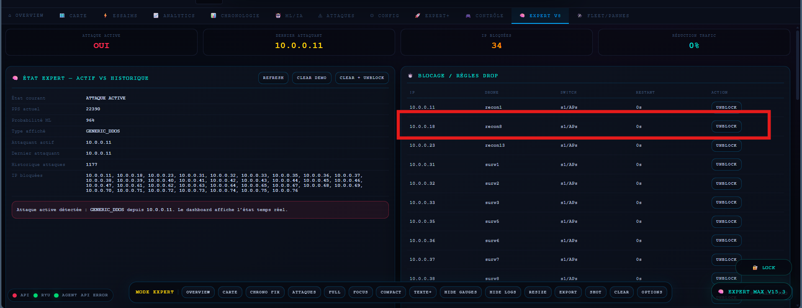

<div align="center">


<br>


<br><br>


</div>

---

# UAV-SDN Intelligent DDoS Detection System

## About the Project

**UAV-SDN Intelligent DDoS Detection System** is an academic cybersecurity project designed to detect and mitigate Distributed Denial of Service attacks in a drone network based on **Software-Defined Networking**.

The project combines:

- UAV network simulation;
- SDN control using Ryu and OpenFlow;
- traffic statistics extraction;
- machine learning-based attack detection;
- real-time dashboard visualization;
- automatic mitigation using OpenFlow rules.

The main focus of this work is to protect the **availability** of UAV communications during cyberattacks.

---

## Research Objective

The objective of this project is to build an intelligent detection and response system capable of identifying abnormal traffic behavior in UAV-SDN environments.

DDoS attacks can affect UAV missions by causing:

- communication loss;
- network congestion;
- service unavailability;
- loss of visibility from the Ground Control Station;
- mission interruption;
- delay in command and control traffic.

This system detects malicious traffic and reacts dynamically through the SDN controller.

---

## Dashboard Preview

### System Overview

<p align="center">
  
</p>

<p align="center">
  <i>General overview of the UAV-SDN cybersecurity dashboard.</i>
</p>

---

### UAV Fleet Map

<p align="center">
  
</p>

<p align="center">
  <i>Real-time visualization of UAV positions, swarms, and operational status.</i>
</p>

---

### Drone Control Panel

<p align="center">
  
</p>

<p align="center">
  <i>Control interface for UAV status, link supervision, and mission monitoring.</i>
</p>

---

### UDP Attack Detection

<p align="center">
  
</p>

<p align="center">
  <i>Detection of abnormal UDP traffic using SDN statistics and ML prediction.</i>
</p>

---

### OpenFlow DROP Mitigation

<p align="center">
  
</p>

<p align="center">
  <i>Automatic mitigation through OpenFlow DROP rules applied by the Ryu controller.</i>
</p>

---

### Machine Learning Analysis

<p align="center">
  
</p>

<p align="center">
  <i>ML-based traffic classification and feature analysis.</i>
</p>

---

## Visual Gallery

<table>
  <tr>
    <td align="center" width="50%">
      
      <br>
      <b>Fleet Map</b>
    </td>
    <td align="center" width="50%">
      
      <br>
      <b>Drone Control</b>
    </td>
  </tr>
  <tr>
    <td align="center" width="50%">
      
      <br>
      <b>Attack Detection</b>
    </td>
    <td align="center" width="50%">
      
      <br>
      <b>OpenFlow Mitigation</b>
    </td>
  </tr>
</table>

---

## Global Architecture

```text
+---------------------+
|      UAV Drones     |
| recon / surv / logi |
+----------+----------+
           |
           v
+---------------------+
| Access Points / OVS |
+----------+----------+
           |
           v
+---------------------+        OpenFlow 1.3        +----------------------+
|   SDN Core Switch   | <-------------------------> | Ryu SDN Controller  |
+----------+----------+                             | ML DDoS Detection   |
           |                                        +----------+-----------+
           v                                                   |
+---------------------+                                        v
|  GCS / Edge Server  |                             +----------------------+
|  Target Services    |                             | Flask Web Dashboard |
+---------------------+                             +----------------------+
```

---

## Main Features

- UAV-SDN topology simulation.
- Ryu SDN controller with OpenFlow 1.3.
- Real-time traffic monitoring.
- Machine learning DDoS detection.
- OpenFlow-based mitigation.
- Real-time cybersecurity dashboard.
- UAV fleet supervision.
- Drone status monitoring.
- Link failure simulation.
- PPS normal and attack visualization.
- Trust score per UAV.
- Mitigation levels from L0 to L4.
- Explainable ML module.
- QoS monitoring.
- PCAP forensics.
- FANET mobility simulation.
- Inter-swarm anomaly correlation.

---

## Project Structure

```text
uav-sdn-ddos-detection/
├── LICENSE
├── README.md
│
├── dashboard.html
├── dashboard_server.py
├── dashboard_server_v3.py
├── ryu_ml_ddos_v3.py
├── topo_expert_uav.py
├── train_model.py
├── attack_orchestrator.py
├── uav_traffic_gen.py
├── lstm_wrapper.py
├── start_simulation.sh
├── dataset_sdn.csv
│
├── avant.png
├── dronecarte1.png
├── dronecontrole.png
├── detectudp.png
├── dropudp.png
└── ml anal.png
```

---

## Main Components

### 1. UAV-SDN Topology

Main file:

```text
topo_expert_uav.py
```

This module creates the UAV-SDN experimental topology using Mininet / Mininet-WiFi.

It includes:

- reconnaissance UAVs;
- surveillance UAVs;
- logistics UAVs;
- Ground Control Station;
- edge server;
- Open vSwitch devices;
- SDN access points;
- REST API for topology control.

---

### 2. Ryu SDN Controller

Main file:

```text
ryu_ml_ddos_v3.py
```

The Ryu controller is responsible for:

- connecting to Open vSwitch;
- collecting OpenFlow statistics;
- extracting network traffic features;
- loading the trained ML model;
- detecting DDoS attacks;
- installing mitigation rules;
- reporting events to the dashboard.

---

### 3. Machine Learning Detection

Main file:

```text
train_model.py
```

The model uses traffic features extracted from SDN flow statistics.

Main features:

```text
pps
src_entropy
syn_ratio
udp_ratio
icmp_ratio
unique_srcs
avg_pkt_size
flow_count
```

Supported models:

- Random Forest;
- SVM;
- LSTM / MLP fallback;
- ensemble voting model.

Training command:

```bash
python3 train_model.py --dataset-mode realistic --noise 0.05 --evaluate
```

Generated outputs:

```text
models/ensemble_model.pkl
models/metrics.json
models/feature_importance.json
```

---

### 4. Dashboard Server

Main file:

```text
dashboard_server_v3.py
```

The dashboard server provides:

- REST APIs;
- WebSocket updates;
- fleet state;
- attack state;
- link state;
- Ryu heartbeat;
- expert intelligence data;
- QoS measurements;
- PCAP actions;
- operator actions.

---

### 5. Web Dashboard

Main file:

```text
dashboard.html
```

The dashboard provides:

- global system status;
- UAV fleet map;
- drone status;
- link supervision;
- attack timeline;
- PPS statistics;
- ML confidence display;
- expert intelligence panel;
- QoS module;
- forensic PCAP module;
- mobility module.

---

## Expert Intelligence Modules

### Trust Score

Each UAV receives a dynamic trust score according to its behavior.

```text
80 - 100  Trusted
55 - 79   Suspicious
30 - 54   Dangerous
20 - 29   Critical
< 20      Block recommended
```

---

### Mitigation Levels

```text
L0  Normal state
L1  Monitoring
L2  Rate limitation
L3  Quarantine
L4  OpenFlow DROP
```

---

### Explainable ML

The dashboard explains the model decision using traffic indicators such as:

- high PPS;
- low source entropy;
- abnormal UDP ratio;
- abnormal SYN ratio;
- abnormal ICMP ratio;
- high flow count.

---

### QoS Monitoring

The system monitors:

```text
latency
jitter
packet loss
bandwidth estimation
```

---

### PCAP Forensics

Suspicious traffic can be captured for offline analysis.

Example:

```text
pcap/uav_recon1_YYYYMMDD_HHMMSS.pcap
```

---

### FANET Mobility

The project supports experimental UAV mobility scenarios, including swarm movement and dynamic topology behavior.

---

## Deployment

The system is designed to run on two virtual machines.

### VM1 — Controller and Dashboard

Example IP:

```text
192.168.100.10
```

Runs:

```text
Dashboard server
Ryu controller
Machine learning model
Expert modules
```

Start dashboard:

```bash
cd /home/uav/drones
python3 dashboard_server_v3.py --no-sim
```

Start Ryu:

```bash
cd /home/uav/drones

ryu-manager ryu_ml_ddos_v3.py \
  --observe-links \
  --ofp-tcp-listen-port 6653
```

---

### VM2 — Mininet Topology

Example IP:

```text
192.168.100.20
```

Runs:

```text
Mininet topology
UAV nodes
Traffic generator
Attack orchestrator
Topology REST agent
```

Start topology:

```bash
cd /home/wifi/drones

sudo mn -c

sudo python3 topo_expert_uav.py \
  --controller 192.168.100.10 \
  --drones-total 50
```

---

## Quick Connectivity Test

Inside Mininet:

```bash
recon1 ping -c 3 gcs
gcs ping -c 3 recon1
recon1 ping -c 3 surv2
```

Expected result:

```text
0% packet loss
```

Check OpenFlow rules:

```bash
sh ovs-ofctl -O OpenFlow13 dump-flows s1 | egrep 'NORMAL|drop|10.0.0.11'
```

---

## Attack Simulation

Example UDP attack:

```bash
recon1 python3 /tmp/attack_orchestrator.py \
  --type udp \
  --target 10.0.0.100 \
  --duration 20
```

Expected behavior:

```text
PPS increases
ML confidence increases
Attacker drone is identified
Trust score decreases
Mitigation level increases
OpenFlow DROP rule may be installed
```

---

## Useful API Endpoints

### Fleet State

```bash
curl -s http://192.168.100.10:5000/api/fleet/pro | python3 -m json.tool
```

### Expert Status

```bash
curl -s http://192.168.100.10:5000/api/expert/v14/status | python3 -m json.tool
```

### QoS Measurement

```bash
curl -s -X POST http://192.168.100.10:5000/api/expert/v14/qos/measure \
  -H "Content-Type: application/json" \
  -d '{"drone":"recon1","count":3}' | python3 -m json.tool
```

### Connectivity Test

```bash
curl -s http://192.168.100.10:5000/api/connectivity/test | python3 -m json.tool
```

---

## Installation Requirements

Recommended environment:

```text
Ubuntu Linux
Python 3.8+
Mininet / Mininet-WiFi
Open vSwitch
Ryu
Flask
Flask-SocketIO
eventlet
scikit-learn
numpy
pandas
joblib
tcpdump
```

Install Python dependencies:

```bash
pip3 install -r requirements.txt
```

---

## Security Notice

This project is for **academic research and controlled laboratory experiments only**.

Do not run the attack scripts on real networks.

Do not commit sensitive files such as:

```text
.env
private keys
real credentials
*.pcap
*.pkl
*.h5
__pycache__/
```

---

## Recommended `.gitignore`

```gitignore
__pycache__/
*.pyc

.venv/
venv/
env/

.env
secrets.json
config_secret.py

models/*.pkl
models/*.h5
models/*.keras
models/*.joblib

pcap/
reports/
*.pcap
*.log

.DS_Store
```

---

## Academic Context

This work was developed as part of a Master project in cybersecurity and information systems security.

Research topic:

```text
Intelligent DDoS Detection in UAV-SDN Environments
```

The project demonstrates how SDN programmability and machine learning can be combined to detect and mitigate DDoS attacks in UAV networks.

---

## Author

<div align="center">

**Developed by [@ademoo077](https://github.com/ademoo077)**

</div>

---

## License

This project is provided for academic and research purposes.

You may use an open-source license such as MIT, Apache-2.0, or a university-specific license depending on your requirements.

---

<div align="center">


</div>
